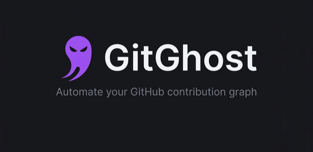

<p align="center">
  
</p>

---

## What is GitGhost?

GitGhost is a local-first tool that bridges your machine and your GitHub repositories. It automates staging, committing, and pushing to any repo you own — running silently in the background while you focus on real work.

- Select a target repository from your account
- Configure commit frequency with simple sliders
- Start the auto-commit pipeline or trigger manual pushes
- Monitor everything through a real-time console

## Features

| Feature | Description |
|---------|-------------|
| **Live Console** | Real-time pipeline log showing every commit, push, and error |
| **Fine-grained Control** | Payload size and interval sliders with second or minute precision |
| **Repository Browser** | Card view of all connected repos with visibility, language, and branch info |
| **Activity Analytics** | Track total commits, pipeline status, and recent activity |
| **Schedule Presets** | One-click presets for light, moderate, or heavy commit schedules |
| **Built-in Guide** | Step-by-step PAT setup instructions with annotated screenshots |

## Tech Stack

- **Frontend:** React + Vite + Tailwind CSS
- **Backend:** Python (FastAPI)
- **Auth:** GitHub OAuth + Personal Access Tokens (classic)

## Getting Started

### Prerequisites

- Node.js (v18+)
- Python (v3.9+)
- A GitHub account

### 1. Clone the repository

```bash
git clone https://github.com/your-username/Git-Tool.git
cd Git-Tool
```

### 2. Setup the backend

```bash
cd backend
pip install -r requirements.txt
```

Create a `.env` file in the backend directory:

```
GITHUB_CLIENT_ID=your_client_id
GITHUB_CLIENT_SECRET=your_client_secret
```

Start the server:

```bash
uvicorn main:app --reload --port 8000
```

### 3. Setup the frontend

```bash
cd frontend
npm install
npm run dev
```

The app will be available at `http://localhost:5173`.

### 4. Generate a Personal Access Token

1. Go to GitHub → Settings → Developer Settings
2. Click **Personal access tokens** → **Tokens (classic)**
3. Click **Generate new token (classic)**
4. Give it a name, select the **repo** scope
5. Copy the token and paste it into the GitGhost login screen

## Project Structure

```
Git-Tool/
├── backend/              # FastAPI server
│   ├── main.py
│   └── requirements.txt
├── frontend/             # React + Vite app
│   ├── src/
│   │   ├── assets/       # Logo, step screenshots
│   │   ├── components/   # Navbar, Footer
│   │   ├── pages/        # Landing, StaticPages
│   │   ├── App.jsx       # Main app with dashboard
│   │   └── index.css     # Global styles
│   └── index.html
├── .gitignore
└── README.md
```

## Screenshots

<p align="center">
  
</p>

## License

This project is for personal and educational use. GitGhost is not affiliated with, sponsored by, or endorsed by GitHub, Inc. or Microsoft.

---

<p align="center">
  Built with purpose. No fluff.
</p>
